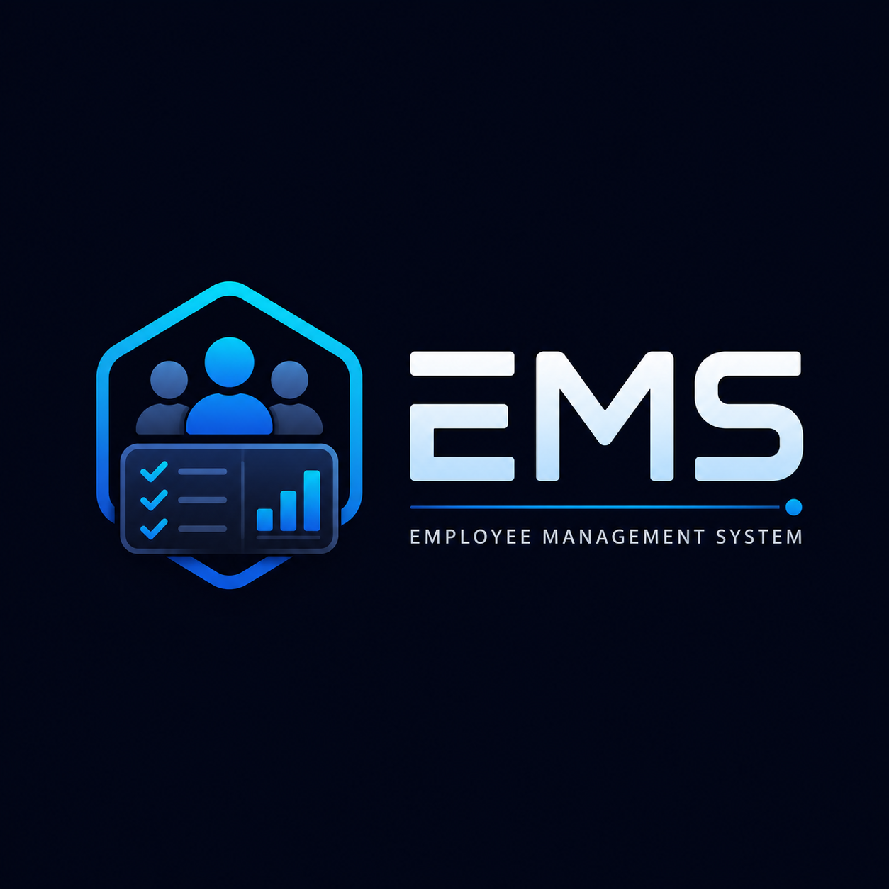

# Employee Management System

A role-based **Employee Management System** built with **React, Context API, Tailwind CSS, and localStorage**.

The project includes separate dashboards for admins and employees, task assignment, task status tracking, employee reports, task priority, and persistent task updates using browser storage.

---

## Logo

<p align="center">
  
</p>

---

## Live Demo

Live Link:

---

## Demo Credentials

### Admin Login

```txt
Email: admin@ems.com
Password: admin123
```

```txt
Email: ops@ems.com
Password: ops123
```

### Employee Login

```txt
Email: raj@ems.com
Password: 123
```

```txt
Email: riya@ems.com
Password: 123
```

---

## Features

### Authentication

* Role-based login system
* Separate admin and employee dashboards
* Logged-in user session stored safely using localStorage
* Logout functionality for both admin and employee
* Demo credential buttons for quick testing

### Admin Dashboard

* Create and assign tasks to employees
* Select employee while creating a task
* Add task title, description, date, category, and priority
* View recently created tasks
* View employee-wise task reports
* Track total new, active, completed, and failed tasks
* Live report updates when employee task status changes

### Employee Dashboard

* View assigned tasks
* View task category, priority, date, and description
* See task status using visual status banners
* Accept new tasks
* Mark active tasks as completed or failed
* View personal task summary cards
* Task changes persist after page refresh

### Data Persistence

* Default admin, employee, and task data comes from static project data
* Updated task data is saved in localStorage
* Refreshing the page keeps updated task status and newly assigned tasks

---

## Tech Stack

* React
* Vite
* Tailwind CSS
* Context API
* JavaScript
* localStorage

---

## Project Screenshots

### Login Page


### Admin Dashboard


### Employee Dashboard


---

## Folder Structure

```txt
employee_management_system
├── public
│   └── ems-logo.png
├── src
│   ├── Components
│   │   ├── Auth
│   │   │   └── Login.jsx
│   │   └── Dashboard
│   │       ├── AdminDashboard
│   │       │   ├── AdminDashboard.jsx
│   │       │   ├── AdminHeader.jsx
│   │       │   ├── CreateTaskForm.jsx
│   │       │   ├── EmployeeReports.jsx
│   │       │   └── RecentCreatedTasks.jsx
│   │       └── EmployeeDashboard
│   │           ├── EmployeeDashboard.jsx
│   │           ├── Header.jsx
│   │           ├── StatsGrid.jsx
│   │           ├── TaskCard.jsx
│   │           └── TaskList.jsx
│   ├── context
│   │   └── AuthProvider.jsx
│   ├── data
│   │   └── emsData.js
│   ├── App.jsx
│   ├── main.jsx
│   └── index.css
├── index.html
├── package.json
├── vite.config.js
└── README.md
```

---

## Installation and Setup

Clone the repository:

```bash
git clone your-repository-url
```

Go to the project folder:

```bash
cd employee_management_system
```

Install dependencies:

```bash
npm install
```

Run the project locally:

```bash
npm run dev
```

Build the project:

```bash
npm run build
```

Preview production build:

```bash
npm run preview
```

---

## Deployment

This project is deployed on Vercel.

Vercel deployment settings:

```txt
Framework Preset: Vite
Build Command: npm run build
Output Directory: dist
Install Command: npm install
```

---

## Important Note

This is a frontend-only project.

The app uses static data and browser localStorage for demo persistence. It does not use a real backend or database.

For production-level usage, the project can be extended with:

* Node.js and Express.js backend
* MongoDB or MySQL database
* JWT authentication
* Real role-based authorization
* API-based task management
* Admin and employee CRUD operations

---

## What I Learned

* Building role-based UI in React
* Managing global state using Context API
* Passing data between admin and employee dashboards
* Creating reusable components
* Updating task status dynamically
* Persisting task changes using localStorage
* Designing responsive dashboards using Tailwind CSS
* Structuring a React project for deployment

---

## Future Improvements

* Add backend using Node.js and Express.js
* Store employees and tasks in MongoDB or MySQL
* Add JWT-based authentication
* Add task filtering and search
* Add charts for admin reports
* Add employee profile management
* Add notification system for newly assigned tasks

---

## Author

**Prakash Kumar Choudhary**

* GitHub: [prakash-k-choudhary](https://github.com/prakash-k-choudhary)
* LinkedIn: [prakash-k-choudhary](https://www.linkedin.com/in/prakash-k-choudhary)

---

## Project Summary

This Employee Management System demonstrates a complete frontend workflow for role-based dashboards. Admins can assign tasks and monitor employee reports, while employees can view assigned tasks and update their task status. The project is built with React, Context API, Tailwind CSS, and localStorage persistence.
